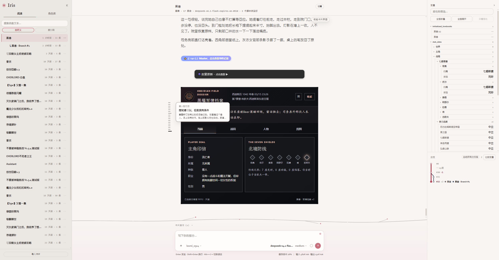
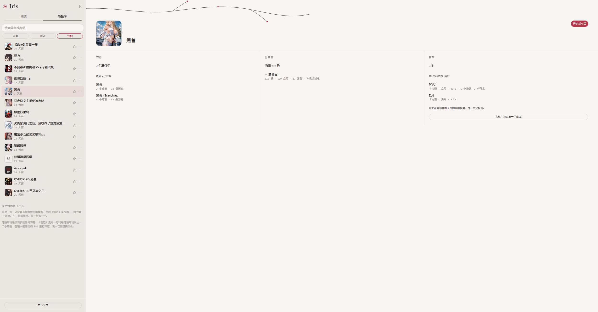
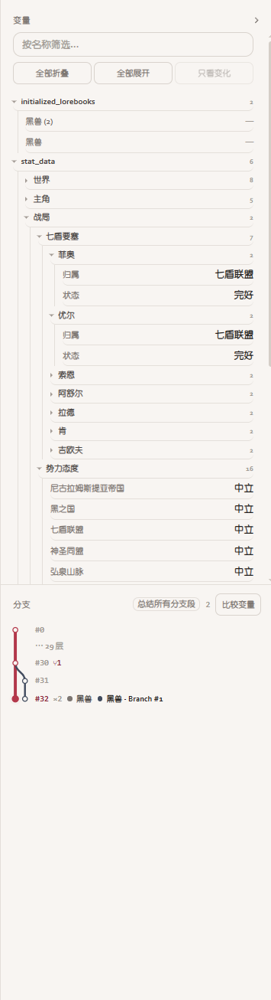
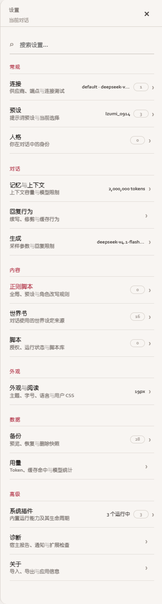
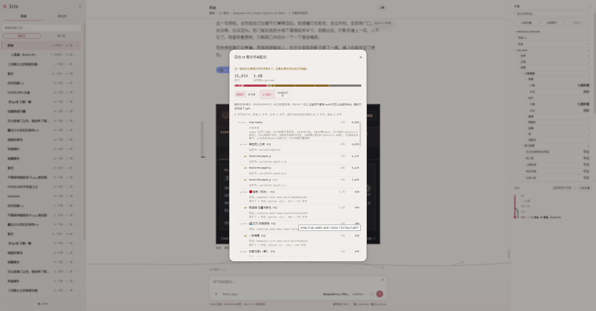

<p align="center">
  
</p>

<h1 align="center">Iris</h1>

<p align="center">本地运行的 AI 角色扮演与聊天应用</p>

<p align="center">
  <a href="#开始使用"></a>
  <a href="docs/ARCHITECTURE.md"></a>
  <a href="LICENSE"></a>
</p>

<p align="center">
  <a href="#界面预览"><b>界面预览</b></a> &nbsp; / &nbsp;
  <a href="#开始使用">开始使用</a> &nbsp; / &nbsp;
  <a href="docs/USER-GUIDE.md">使用手册</a> &nbsp; / &nbsp;
  <a href="docs/README.md">开发文档</a> &nbsp; / &nbsp;
  <a href="CONTRIBUTING.md">参与贡献</a>
</p>

---

Iris 支持 SillyTavern 的角色卡、世界书、Chat Completion 预设和聊天记录，基于 Cordis 插件架构构建。你可以带着已有的角色与对话开始，也可以在这里创建新的故事。

## 在 Iris 里

<table>
  <tr>
    <td width="50%" valign="top">
      <h3>角色与世界</h3>
      <p>导入角色卡，管理世界书、预设和用户人设。</p>
    </td>
    <td width="50%" valign="top">
      <h3>对话与分支</h3>
      <p>流式回复、切换候选、对话分支、内容搜索与聊天备份。</p>
    </td>
  </tr>
  <tr>
    <td width="50%" valign="top">
      <h3>阅读与外观</h3>
      <p>「雪」「墨」「宣」三套主题，可调整字号、行距与阅读设置。</p>
    </td>
    <td width="50%" valign="top">
      <h3>脚本与插件</h3>
      <p>支持酒馆助手、MVU、EJS 模板的兼容能力，通过插件中心安装和管理扩展。</p>
    </td>
  </tr>
</table>

## 界面预览

**阅读与卡片界面**：对话正文、人物卡展示、变量和分支并排呈现。

<p align="center">
  <a href="assets/screenshots/reading-mvu.png"></a>
</p>

**角色库**：查看角色的对话、世界书和脚本。

<p align="center">
  <a href="assets/screenshots/character-library.png"></a>
</p>

<table>
  <tr>
    <td align="center" valign="top"><strong>变量与分支</strong><br><a href="assets/screenshots/variables-and-branches.png"></a></td>
    <td align="center" valign="top"><strong>设置</strong><br><a href="assets/screenshots/settings.png"></a></td>
  </tr>
</table>

<details>
<summary>查看上下文构成</summary>

<p align="center">
  <a href="assets/screenshots/context-breakdown.png"></a>
</p>

</details>

角色、聊天和设置保存在本机。模型由你选择；使用远程服务时，对话会发送到所配置的端点。

项目仍在持续开发，脚本和扩展的兼容程度取决于所用接口。具体限制见[使用手册](docs/USER-GUIDE.md#兼容范围)和[接口清单](docs/INFRASTRUCTURE-INTERFACES.md)。

## 开始使用

需要 **Node.js 24+、pnpm 11 和 npm**（pnpm 的确切版本见根 `package.json` 的 `packageManager`）。目前从源码安装。

```sh
git clone https://github.com/kkiwkK1/iris_harness.git
cd iris_harness
pnpm install --frozen-lockfile
npm --prefix apps/iris-web ci
pnpm build:web
pnpm start
```

打开终端显示的地址，默认是 <http://127.0.0.1:8787>。

1. 在 **设置 → 连接** 中添加模型服务，填写端点、模型和所需的 API Key，测试后启用。
2. 在 **角色库** 中导入角色卡；世界书和预设可在设置中导入。
3. 选择角色，开始对话。

Iris 通过 OpenAI 兼容接口连接模型，可使用 DeepSeek、OpenRouter 等远程服务，也可连接 Ollama、llama.cpp 或 LM Studio 的兼容端点。Iris 本身不附带模型。

> [!NOTE]
> 卡片脚本需要逐张授权；EJS 模板另需启用。默认服务仅供本机访问，不自带登录认证。配置说明见[使用手册](docs/USER-GUIDE.md)。

## 从 SillyTavern 迁移

从界面导入角色卡、世界书、预设和聊天 JSONL。聊天导入时需要选择所属角色，导出的记录也可带回 SillyTavern。

为 Iris 使用独立的数据目录，**不要直接把 SillyTavern 的数据目录设为 `IRIS_DATA_DIR`**。世界书扫描参数、扩展数据和卡片运行状态不会随文件自动迁移。

→ [查看迁移步骤](docs/USER-GUIDE.md#从-sillytavern-迁移)

## 文档

| 想做什么 | 从这里开始 |
| --- | --- |
| 配置模型、迁移数据、处理常见问题 | [使用手册](docs/USER-GUIDE.md) |
| 了解项目结构 | [架构说明](docs/ARCHITECTURE.md) |
| 编写或安装插件 | [插件开发](docs/PLUGIN-AUTHORING-RUNBOOK.md) · [安装机制](docs/SYSTEM-PLUGIN-INSTALL.md) |
| 了解卡片脚本的权限 | [脚本授权](docs/AUTORUN.md) · [沙箱说明](docs/SANDBOX.md) |
| 查找其他文档与兼容差异 | [文档目录](docs/README.md) |

## 参与开发

宿主在 `apps/iris`，浏览器界面在 `apps/iris-web`，领域逻辑和兼容层在 `packages/`。

<details>
<summary><b>本地检查命令</b></summary>

完成上面的安装与构建后，可在仓库根目录运行：

```sh
pnpm typecheck
npm --prefix apps/iris-web run typecheck
pnpm test
pnpm run test:no-corpus
npm --prefix apps/iris-web run check:render
```

修改界面后需重新运行 `pnpm build:web`。前端开发服务器与数据源的用法见[界面开发说明](apps/iris-web/README.md)，提交流程见[贡献指南](CONTRIBUTING.md)。

</details>

欢迎提交问题和 PR。报告兼容问题时，请附上复现步骤和相关报错；分享日志或示例前，去掉密钥和私人对话。

## 致谢与许可

感谢 [SillyTavern](https://github.com/SillyTavern/SillyTavern)、[ST-Prompt-Template](https://github.com/zonde306/ST-Prompt-Template)、[MagVarUpdate](https://github.com/MagicalAstrogy/MagVarUpdate)、[TavernHelper](https://github.com/N0VI028/JS-Slash-Runner)，以及 Cordis 和 `@deepseek-ai/*` 的开发者与社区。

Iris 以 [GNU AGPL-3.0](LICENSE) 发布。第三方代码与依赖的许可信息见 [THIRD-PARTY-NOTICES.md](THIRD-PARTY-NOTICES.md)。

---

<p align="center">
  <sub>Copyright © 2026 kkiwkK1 and Iris contributors.</sub>
</p>
